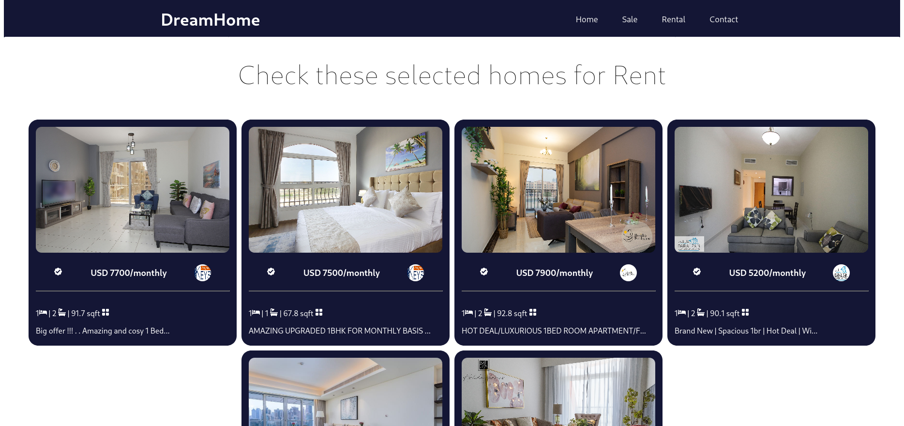
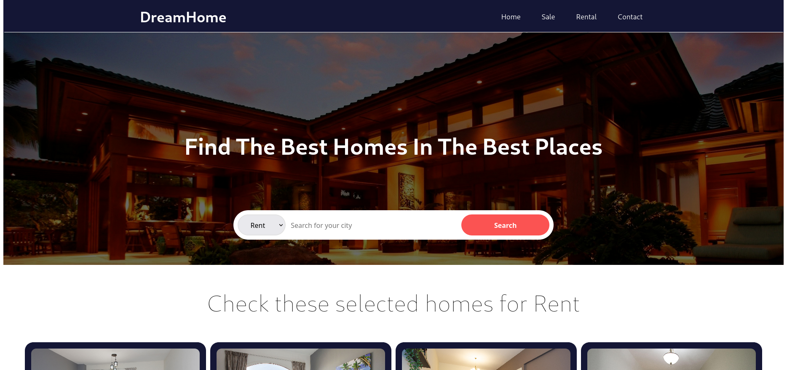

This is a [Next.js](https://nextjs.org/) project bootstrapped with [`create-next-app`](https://github.com/vercel/next.js/tree/canary/packages/create-next-app).

## Getting Started

First, run the development server:

```bash
npm run dev
# or
yarn dev
```

Open [http://localhost:3000](http://localhost:3000) with your browser to see the result.

## About This Project

This project was made using ReactJS, Axios, NextJS with the Bayut API from RapidAPI. I made this project to train some Component skill i've learnt so far.





## Contact me
If you want to know more about me or the projects i'm working on you can contact me on allyson2308h@gmail.com. You can view more of my projects at                   https://github.com/all123all.
